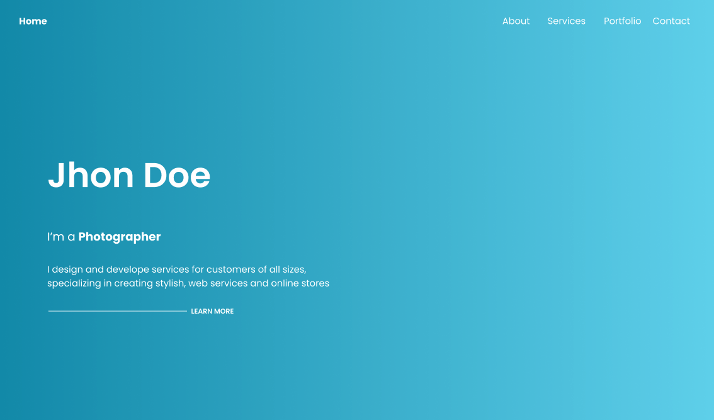

# Challenge # 2

Bienvenid@ al reto #2 del curso Lenguajes de programación para la web. 
Tu misión, si decides aceptarla, será intentar replicar el prototipo del siguiente figma tan parecido como sea posible.

- Link al figma: https://www.figma.com/file/LSjCUKAqWzdtZVh3Z3CdGT/Tarea-2--v3?type=design&node-id=0%3A1&mode=dev&t=gQzsHmi3qSrgmQsh-1

## A tener en cuenta:

- Todas la imágenes deberán incluir ALTs
- Utilizar BEM
- Utiliza HTML Semántico
- Tu código HTML y CSS deberá ser formateado a 2 espacios
- El código debe ser legible y ordenado
- Desplegar tu solución utilizando github pages
- El resultado final debe verse bien en desktop, tablet y mobile utilizando los siguientes breakpoints:
  - *Mobile*: 320px a  480px.
  - *Ipads y Tablets*: 481px a 768px.
  - *Laptops y  pantallas pequeñas*: 769px - 1024px.
  - *Desktop y pantallas grandes*: 1025px en adelante.
- Las imágenes requeridas las puedes encontrar en la carpeta `assets` del actual repositorio (Ten en cuenta que las imágenes no necesariamente están optimizadas).
- Los mensajes de tus commits deberán ser todos en inglés.
- Los nombres de las clases/ids que utilices deberán ser en inglés.

## Pasos a seguir:

1. Haz el fork de este repo
2. Implementa tu solución

## Modo de entrega

Una vez termines tu solución, deberás compartir:
1. El link del Pull Request
2. El link de tu solución desplegada en github pages.

## Hacker edition:
Los siguientes requerimientos no son obligatorios:
- Los links del header deben llevar a las diferentes secciones de la página.

